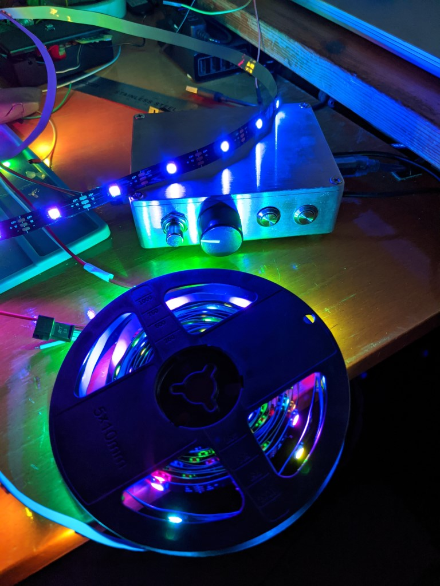

# Arduino LED controllers

This project controls LEDs attached to an Arduino Uno. It uses an attached potentiometer for brightness control, and two buttons for choosing light colours and animations.